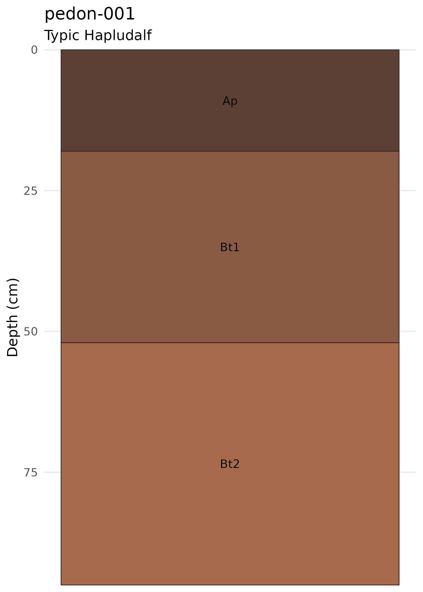

# Getting Started with soilgraph

## Overview

**soilgraph** provides tools for structuring soil profile descriptions,
exporting them to JSON, and generating profile visualizations. A typical
workflow is:

1.  Prepare a two-column field description table (**Depth** +
    **description**).
2.  Parse descriptions into a structured soil profile.
3.  Visualize the profile.
4.  Export to the `.soil.json` format for archival and exchange.

``` r
library(soilgraph)
```

## Creating a field description table

Field notes are represented as a data frame with a `Depth` column
containing depth ranges (e.g. `"0-18 cm"`) and a `description` column
with natural language descriptions:

``` r
field_notes <- data.frame(
  Depth = c("0-18 cm", "18-52 cm", "52-95 cm"),
  description = c(
    "Ap dark brown silt loam moist clear smooth few subangular weak fragments with granular structure",
    "Bt1 reddish brown clay loam slightly moist gradual wavy common rounded moderate fragments with clay films",
    "Bt2 brown clay dry diffuse irregular many subrounded strong fragments with strong blocky structure"
  )
)
field_notes
#>      Depth
#> 1  0-18 cm
#> 2 18-52 cm
#> 3 52-95 cm
#>                                                                                                 description
#> 1          Ap dark brown silt loam moist clear smooth few subangular weak fragments with granular structure
#> 2 Bt1 reddish brown clay loam slightly moist gradual wavy common rounded moderate fragments with clay films
#> 3        Bt2 brown clay dry diffuse irregular many subrounded strong fragments with strong blocky structure
```

## Parsing descriptions

[`derive_soil_horizons()`](https://nriveras.github.io/soilgraph/reference/derive_soil_horizons.md)
extracts horizon properties (texture, color, moisture, boundary, coarse
fragments) from the description text and returns a tidy table:

``` r
horizons <- derive_soil_horizons(field_notes)
horizons
#>      Depth
#> 1  0-18 cm
#> 2 18-52 cm
#> 3 52-95 cm
#>                                                                                                 description
#> 1          Ap dark brown silt loam moist clear smooth few subangular weak fragments with granular structure
#> 2 Bt1 reddish brown clay loam slightly moist gradual wavy common rounded moderate fragments with clay films
#> 3        Bt2 brown clay dry diffuse irregular many subrounded strong fragments with strong blocky structure
#>   Horizon Top Bottom   Texture       Moisture   Color BoundaryGrade
#> 1      Ap   0     18 silt loam          moist #5C4033         clear
#> 2     Bt1  18     52 clay loam slightly moist #7B3F2A       gradual
#> 3     Bt2  52     95      clay            dry #8B5A2B       diffuse
#>   BoundaryShape CoarseAbundance CoarseShape CoarseGrade CoarseType CoarseSize
#> 1        smooth             few  subangular        weak       <NA>       <NA>
#> 2          wavy          common     rounded    moderate       <NA>       <NA>
#> 3     irregular            many  subrounded      strong       <NA>       <NA>
#>   CoarseColor CoarsePercent                             Notes
#> 1        <NA>            NA fragments with granular structure
#> 2        <NA>            NA         fragments with clay films
#> 3        <NA>            NA   fragments with blocky structure
```

The parser recognizes two input modes:

- **Depth ranges**: `"0-18 cm"`, `"18-52 cm"`, `"52-95 cm"`
- **Top depths only**: `"0"`, `"18"`, `"52"` — requires a
  `profile_bottom` argument.

``` r
top_depth_notes <- data.frame(
  Depth = c("0", "18", "52"),
  description = c(
    "Ap dark brown silt loam moist clear smooth",
    "Bt1 reddish brown clay loam gradual wavy",
    "Bt2 brown clay dry diffuse irregular"
  )
)

horizons_top <- derive_soil_horizons(top_depth_notes, profile_bottom = 95)
horizons_top[, c("Horizon", "Top", "Bottom", "Texture", "Color")]
#>   Horizon Top Bottom   Texture   Color
#> 1      Ap   0     18 silt loam #5C4033
#> 2     Bt1  18     52 clay loam #7B3F2A
#> 3     Bt2  52     95      clay #8B5A2B
```

## Building a soil profile object

[`soil_profile_from_table()`](https://nriveras.github.io/soilgraph/reference/soil_profile_from_table.md)
converts a field notes table into a `soil_profile` object, which is the
primary data structure used by all plotting and export functions:

``` r
profile <- soil_profile_from_table(
  field_notes,
  site_id = "pedon-001",
  classification = list(
    system = "Soil Taxonomy",
    taxon  = "Typic Hapludalf"
  ),
  metadata = list(country = "Chile", land_use = "cropland")
)
```

You can also build profiles manually from individual horizons:

``` r
h1 <- new_soil_horizon(0, 18, label = "Ap", color = "#5C4033",
  texture = "silt loam", boundary_grade = "clear", boundary_shape = "smooth")
h2 <- new_soil_horizon(18, 52, label = "Bt1", color = "#8A5A44",
  texture = "clay loam", boundary_grade = "gradual", boundary_shape = "wavy")
h3 <- new_soil_horizon(52, 95, label = "Bt2", color = "#A66A4C",
  texture = "clay", boundary_grade = "diffuse", boundary_shape = "irregular")

profile_manual <- new_soil_profile(
  site_id = "pedon-001",
  horizons = list(h1, h2, h3),
  classification = list(system = "Soil Taxonomy", taxon = "Typic Hapludalf")
)
```

Use
[`validate_soil_profile()`](https://nriveras.github.io/soilgraph/reference/validate_soil_profile.md)
to check depth ordering and overlap constraints:

``` r
validate_soil_profile(profile_manual)
```

## Plotting

### Basic profile

``` r
plot_soil_profile(profile)
```


Basic soil profile visualization.

### Profile with coarse fragment markers

Point-based markers encode fragment type (shape), size (point size), and
cementation grade (alpha):

``` r
plot_soil_profile_fragments(profile, seed = 42)
```


Profile with coarse fragment point markers.

### Advanced visualization

The advanced renderer uses polygon-based fragments and irregular
boundary lines:

``` r
plot_soil_profile_advanced(profile, seed = 42)
#> Scale for fill is already present.
#> Adding another scale for fill, which will replace the existing scale.
#> Scale for alpha is already present.
#> Adding another scale for alpha, which will replace the existing scale.
```


Advanced profile with polygon fragments, boundaries, and transition
zones.

### Plotting directly from field notes

For quick visualization without creating objects manually:

``` r
plot_soil_description(field_notes, site_id = "pedon-001")
```


Plot directly from field description table.

## Exporting and importing JSON

The `.soil.json` format stores profiles with all metadata in a
standardized schema:

``` r
# Write to a temporary file
tmp <- tempfile(fileext = ".soil.json")
write_soil_json(profile, tmp)

# Inspect the JSON structure
cat(readLines(tmp, n = 15), sep = "\n")
#> {
#>   "schema_version": "0.1.0",
#>   "site_id": "pedon-001",
#>   "classification": {
#>     "system": "Soil Taxonomy",
#>     "taxon": "Typic Hapludalf"
#>   },
#>   "metadata": {
#>     "country": "Chile",
#>     "land_use": "cropland"
#>   },
#>   "horizons": [
#>     {
#>       "top": 0,
#>       "bottom": 18,
```

Read it back:

``` r
profile_reloaded <- read_soil_json(tmp)
profile_reloaded$site_id
#> [1] "pedon-001"
profile_reloaded$classification$taxon
#> [1] "Typic Hapludalf"
length(profile_reloaded$horizons)
#> [1] 3
```

## Reading bundled example data

The package ships with example files in `inst/extdata/`:

``` r
json_path <- system.file("extdata", "example.soil.json", package = "soilgraph")
example_profile <- read_soil_json(json_path)
plot_soil_profile(example_profile)
```



## Next steps

- Learn about the advanced graphical engines in
  [`vignette("graphical-engines")`](https://nriveras.github.io/soilgraph/articles/graphical-engines.md).
- Explore the soil data model and supported vocabulary in
  [`vignette("soil-data-model")`](https://nriveras.github.io/soilgraph/articles/soil-data-model.md).
- Browse a gallery of rendering examples in
  [`vignette("rendering-examples")`](https://nriveras.github.io/soilgraph/articles/rendering-examples.md).
